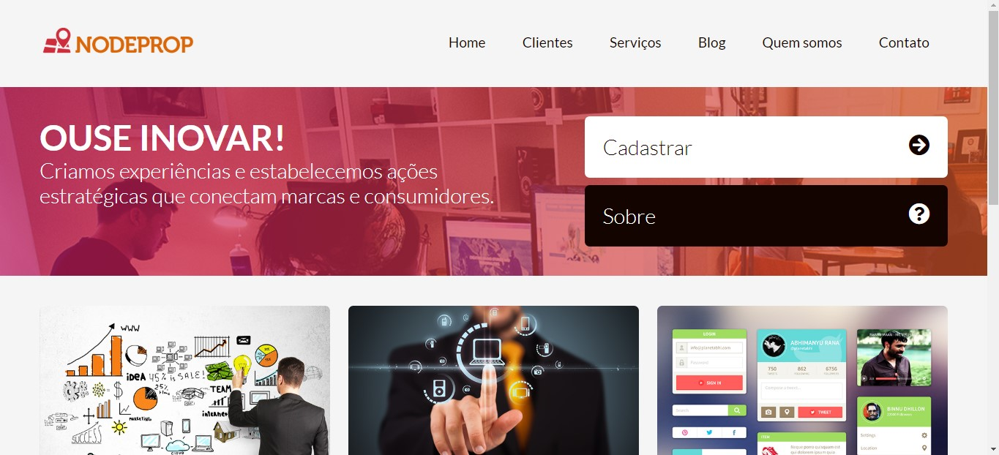
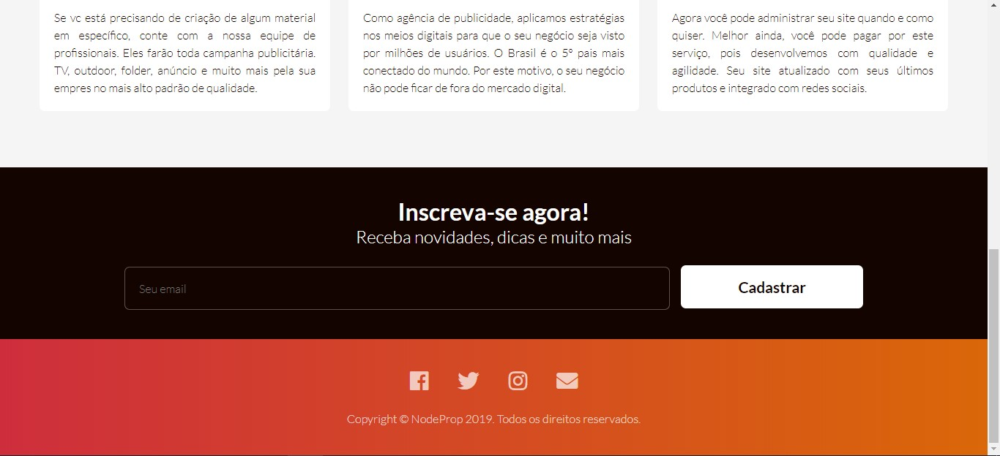
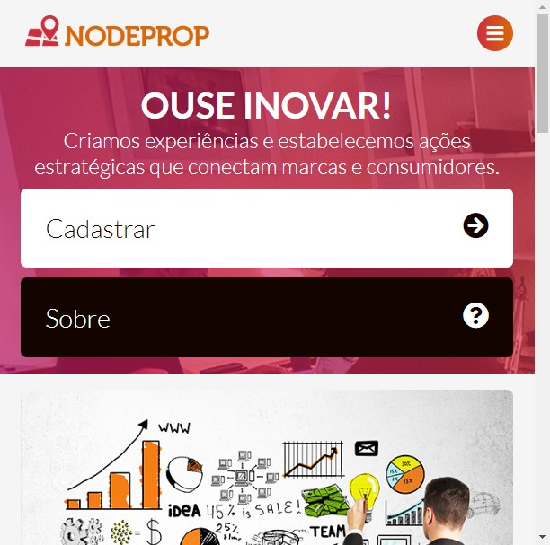
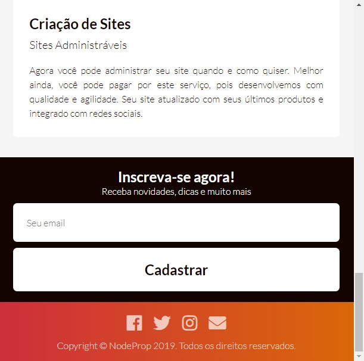
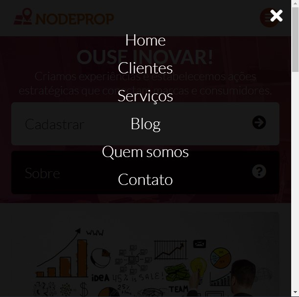

<h1 align="center">
 
  
 
NODEPROP
</h1>

Projeto estático responsivo desenvolvido utilizando somente CSS e Media Queries.

  

  
   
  

   
  
   
  

   
  
   
  

   
  
  
   
  

   
  
   

## Features

Essa aplicação foi desenvolvida com o intuito de praticar Front-End e responsividade.

## Getting started

Baixe ou clone o repositório: https://github.com/vitorbafoni/NodeProp.git e abra o arquivo index.html

## License

This project is licensed under the MIT License - see the [LICENSE](https://opensource.org/licenses/MIT) page for details.
